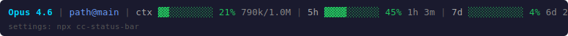

# cc-statusbar

Real-time status bar for [Claude Code](https://claude.ai/claude-code) showing rate limits, context usage, and dev server monitoring.

[](https://www.npmjs.com/package/cc-statusbar)
[](LICENSE)



## Install

```bash
npm install -g cc-statusbar
cc-statusbar install
```

Or with npx (no global install):

```bash
npx cc-statusbar install
```

Restart Claude Code. Done.

Updates check daily and apply silently in the background — no manual reinstall needed.

## Configure

Open the interactive settings TUI:

```bash
cc-statusbar        # if installed globally
npx cc-statusbar    # or via npx
```

Keyboard navigation:
- `↑↓` Navigate
- `Space/Enter` Toggle on/off
- `←→` Adjust values
- `Esc` Exit

All changes save instantly and reflect in the status bar within 1 second.

AI assistants (Claude Code) can also edit `~/.claude/statusline.conf` directly.

## What it shows

| Section | Example | Description |
|---------|---------|-------------|
| Model | `Opus 4.6 (1M context)` | Current model and context window |
| Path | `myproject@main` | Directory + git branch |
| Context | `ctx ▓▓░░░░░░░░ 21% 790k/1.0M` | Context window usage + remaining tokens |
| 5h limit | `5h ▓▓▓▓░░░░░░ 45% 1h 3m` | 5-hour rate limit + time until reset |
| 7d limit | `7d ░░░░░░░░░░ 4% 6d 22h 1m` | 7-day rate limit + time until reset |
## Bar styles

6 built-in styles, configurable via TUI:

| Style | Example |
|-------|---------|
| blocks | `▓▓▓▓░░░░░░` |
| dots | `●●●●○○○○○○` |
| squares | `■■■■□□□□□□` |
| lines | `━━━━──────` |
| triangles | `▰▰▰▰▱▱▱▱▱▱` |
| ascii | `####......` |

## Multi-language

10 languages supported. Change in TUI — all labels update instantly.

English, 한국어, 日本語, 中文, Español, Français, Deutsch, Português, Русский, Tiếng Việt

```
# English
ctx ▓▓░░░░░░░░ 21% | 5h ▓▓▓▓░░░░░░ 45% | 7d ░░░░░░░░░░ 4%

# 한국어
컨텍스트 ▓▓░░░░░░░░ 21% | 5시간 ▓▓▓▓░░░░░░ 45% | 7일 ░░░░░░░░░░ 4%
```

## Color coding

- Green: < 50%
- Yellow: 50-80%
- Red: > 80%

## Configuration file

`~/.claude/statusline.conf` (auto-created on install):

```bash
# Sections (true/false)
SHOW_MODEL=true
SHOW_PATH=true
SHOW_GIT_BRANCH=true
SHOW_CONTEXT=true
SHOW_5H_LIMIT=true
SHOW_7D_LIMIT=true
SHOW_COST=false
SHOW_COMMANDS=true
LANGUAGE=en

# Bar appearance
BAR_STYLE=blocks
BAR_WIDTH=10
BAR_FILL="▓"
BAR_EMPTY="░"
```

## Commands

```bash
cc-statusbar                # Open settings TUI
cc-statusbar install        # Install to Claude Code
cc-statusbar uninstall      # Remove
cc-statusbar update         # Force reinstall latest
cc-statusbar help           # Help
```

All commands work with `npx cc-statusbar ...` too if you prefer not to install globally.

## Requirements

- Claude Code CLI
- bash (WSL or native)
- No external dependencies (no jq)

## License

[MIT](LICENSE)
